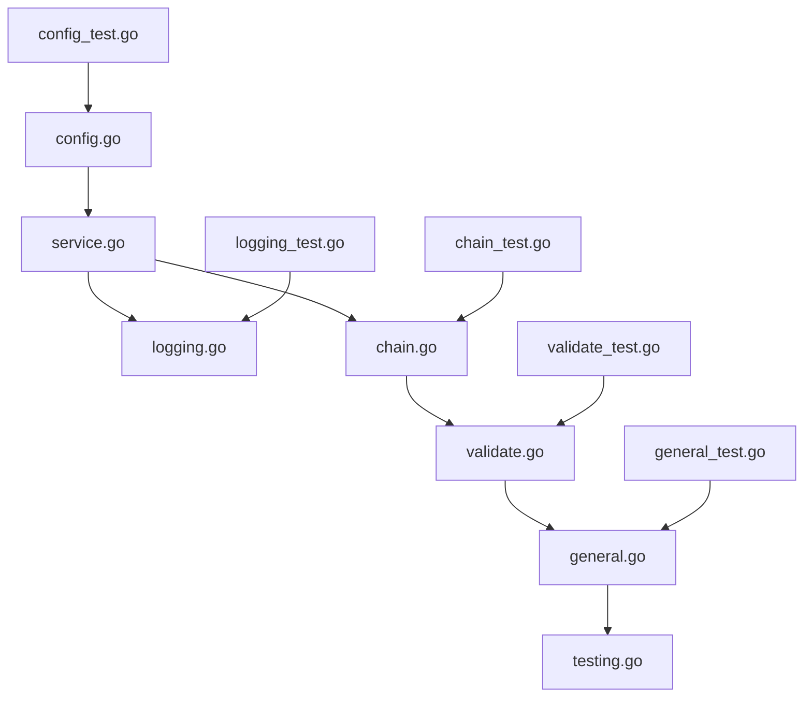

# System Architecture

## High-Level Architecture Diagram

(Include a diagram here if needed. Replace this text with a Markdown-compatible diagram or a link to an image.)

## Key Components Overview

1. **Blockchain Indexer**: Handles blockchain data collection and indexing.
2. **REST API Server**: Exposes APIs for data access.
3. **IPFS Integrator**: Manages decentralized storage.
4. **Configuration Manager**: Parses `.env` files and other configurations.

## Interactions Between Components

- The Blockchain Indexer collects data from RPC endpoints and stores it in the local database.
- The REST API retrieves indexed data and exposes it via endpoints.
- The IPFS Integrator uploads and pins indexed data to IPFS for decentralized access.
