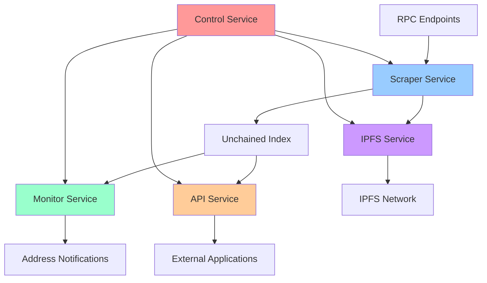

# Understanding Khedra

## Core Concepts

### The Unchained Index

The foundation of Khedra is the Unchained Index - a specialized data structure that maps blockchain addresses to their appearances in blockchain data. Think of it as a reverse index: while a blockchain explorer lets you look up a transaction and see which addresses were involved, the Unchained Index lets you look up an address and see all transactions where it appears.

The index captures appearances from multiple sources:

- **External Transactions**: Direct sends and receives
- **Internal Transactions**: Contract-to-contract calls (from traces)
- **Event Logs**: Events emitted by smart contracts
- **State Changes**: Modifications to contract storage
- **Special Appearances**: Block rewards, validators, etc.

What makes this particularly powerful is that the index includes trace-derived appearances - meaning it captures internal contract interactions that normal blockchain explorers miss.

### Address Appearances

An "appearance" in Khedra means any instance where an address is referenced in blockchain data. Each appearance record contains:

- The address that appeared
- The block number where it appeared
- The transaction index within that block
- Additional metadata about the appearance type

These compact records allow Khedra to quickly answer the fundamental question: "Where does this address appear in the blockchain?"

### Local-First Architecture

Khedra operates as a "local-first" application, meaning:

1. All data processing happens on your local machine
2. Your queries never leave your computer 
3. You maintain complete ownership of your data
4. The application continues to work without internet access

This approach maximizes privacy and resilience while minimizing dependency on external services.

### Distributed Collaboration

While Khedra is local-first, it also embraces distributed collaboration through IPFS integration:

- The Unchained Index can be shared and downloaded in chunks
- Users can contribute to different parts of the index
- New users can bootstrap quickly by downloading existing index portions
- The system becomes more resilient as more people participate

This creates a hybrid model that preserves privacy while enabling community benefits.

## System Architecture

### Service Components

Khedra is organized into five core services:

1. **Control Service**
   - Provides minimal pause / unpause endpoints (`/pause`, `/unpause`, `/isPaused`)
   - Does not (yet) implement start/stop/restart, health metrics, or runtime config changes
   - Always started and not user‑pausable

2. **Scraper Service**
   - Processes blockchain data to build the Unchained Index
   - Extracts address appearances from blocks, transactions, and traces
   - Works in configurable batches with adjustable sleep intervals

3. **Monitor Service**
   - Tracks specific addresses of interest
   - Provides notifications for address activities
   - Maintains focused indices for monitored addresses

4. **API Service**
   - Exposes data through REST endpoints (defined here: [API Docs](https://trueblocks.io/api/))
   - Provides query interfaces for the index and monitors
   - Enables integration with other tools and services

5. **IPFS Service**
   - Facilitates distributed sharing of index data
   - Handles publishing and retrieving chunks via IPFS
   - Enables collaborative index building

### Data Flow and Service Interactions

Here's how data flows through the Khedra system and how services interact:

#### Detailed Service Interactions

1. **Control Service** (Central Hub)
   - Manages lifecycle of all other services
   - Coordinates startup/shutdown sequences
   - Monitors health and performance of all services
   - Provides management API accessible to external tools

2. **Data Processing Flow**:
   - **Scraper** retrieves blockchain data from RPC endpoints
   - Address appearances are extracted and stored in the **Unchained Index**
   - **Monitor** service checks new blocks against watched address lists
   - **API** service provides query access to indexed data
   - **IPFS** service optionally shares index chunks with the network

3. **Service Dependencies**:
   - **Monitor** depends on **Scraper** for real-time block data
   - **API** depends on **Unchained Index** created by **Scraper**
   - **IPFS** can operate independently but enhances **Scraper** functionality
   - All services depend on **Control** service for management operations

#### Independent vs Coordinated Services

**Services that can run independently:**
- **API Service**: Can serve existing index data without other services
- **IPFS Service**: Can share/retrieve data independently of indexing
- **Control Service**: Always runs and manages others

**Services that work better together:**
- **Scraper + Monitor**: Monitor gets real-time data from Scraper
- **Scraper + IPFS**: IPFS can automatically share new index chunks
- **Scraper + API**: API serves fresh data as Scraper creates it

#### Service Startup Order

Current code starts Control first, then iterates over the configured services map (Go map iteration order is not guaranteed). There is no enforced dependency sequence beyond Control being available.
