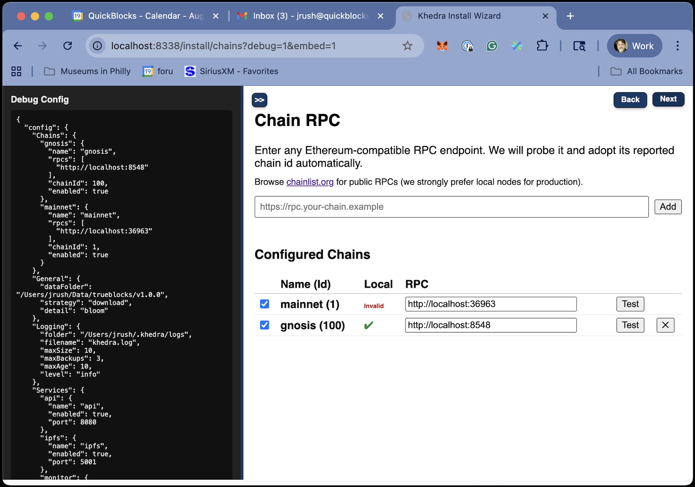

# Chains Screen

## Purpose

- Configures blockchain connections for indexing and monitoring
- Ensures proper RPC endpoint setup for each chain
- Explains the requirement for Ethereum mainnet

## Key Features

- Multiple chain support with standardized naming
- RPC endpoint configuration and validation
- Clear explanation of requirements and format

## Chain Configuration

The chains configuration screen guides you through setting up:

1. **Ethereum Mainnet (Required)**
   - At least one valid RPC endpoint
   - Used for core functionality and the Unchained Index

2. **Additional EVM Chains (Optional)**
   - Sepolia, Gnosis, Optimism, and other EVM-compatible chains
   - Each requires at least one RPC endpoint
   - Enable/disable option for each chain

## RPC Endpoint Requirements

For each chain, you must provide:

- A valid RPC URL in the format `protocol://host:port`
- Proper authentication details if required (e.g., Infura project ID)
- Endpoints with sufficient capabilities for indexing (archive nodes recommended)

## Validation Checks

The wizard performs these validations on each RPC endpoint:

- URL format validation
- Connection test to verify the endpoint is reachable
- Chain ID verification to ensure the endpoint matches the selected chain
- API method support check for required JSON-RPC methods
