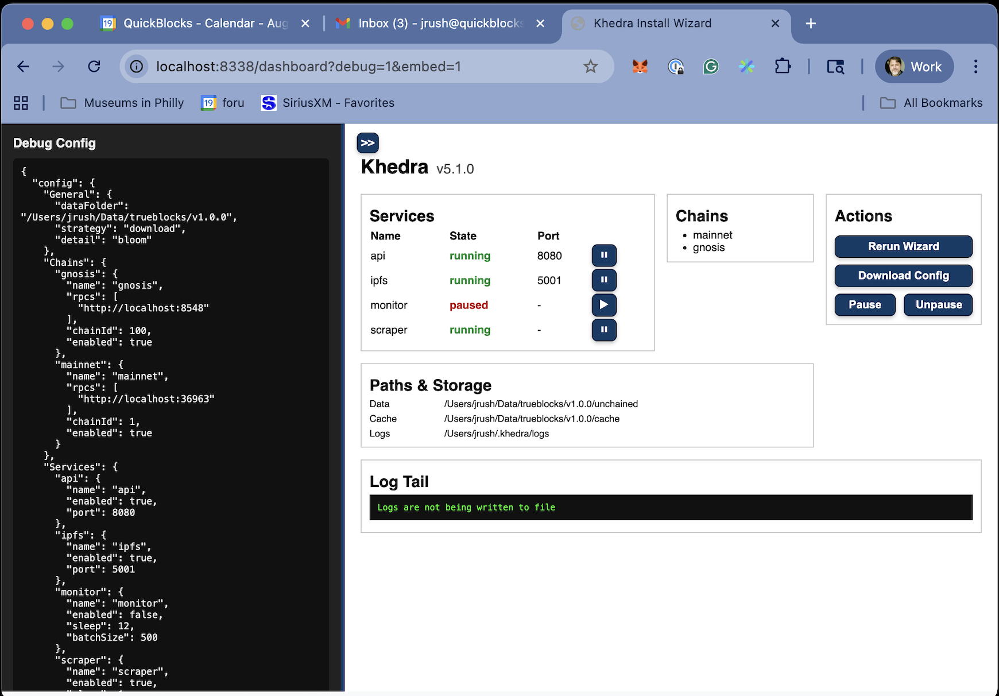

# Dashboard Screen

## Purpose

- Provides an overview of the Khedra installation status
- Displays service states and available chains
- Shows key file paths and log status
- Offers quick actions for configuration and control

## Main Features

- **Services Table**: Shows the state (running/paused) and port of each service (api, ipfs, monitor, scraper)
- **Chains List**: Displays enabled chains (mainnet, gnosis)
- **Actions Panel**: Buttons for rerunning the wizard, downloading config, pausing, and unpausing services
- **Paths & Storage**: Lists locations for data, cache, and logs
- **Log Tail**: Shows recent log status (e.g., "Logs are not being written to file")
