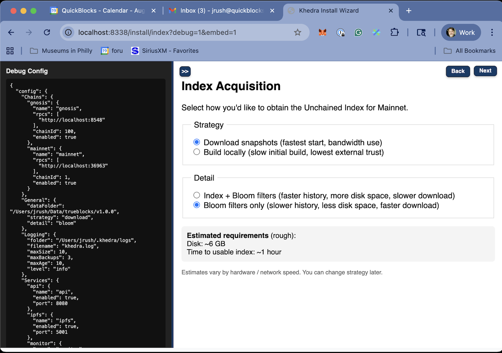

# Index Screen

## Purpose

- Allows users to configure the method by which the Unchained Index is created or downloaded
- The Unchained Index is required for the applications to properly function
- Estimates of disc space usage are exactly that -- estimates.

## Key Features

- The Unchained Index will be stored in the [Data Folder]/unchained.
- Blooms are much smaller than the index, but take longer to find histories
- Indexes are larger, but do not need to be downloaded later

## Configuration Options

The General Settings screen presents these key configuration options:

1. **Index Download Strategy**:
   - Download: Prioritize downloading from the distributed network
   - Scratch: Prioritize building the index locally
   - Index + Blooms: Download or build both the indexes and the blooms
   - Blooms: Download only bloom filters.
