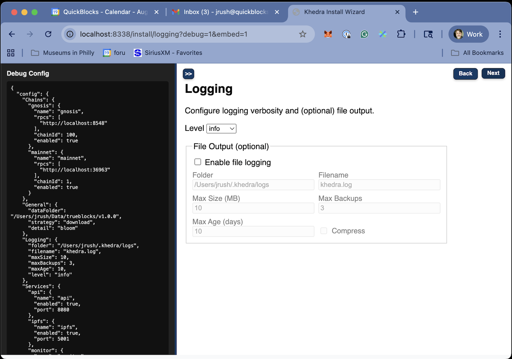

# Logging Screen

## Purpose

- Allows users to configure logging options
- Allows for toFile or onlyConsole
- Configures logging behavior

## Key Features

- Set up logging preferences for troubleshooting
- Options for path expansion (supporting $HOME and ~/ notation)
- Input validation for directory existence and write permissions

## Configuration Options

The Logging Settings screen presents these key configuration options:

1. **Logging Folder**: Where Khedra stores all index and cache data
   - Default: `~/.khedra/logs`
   - Must be a writable location with sufficient disk space
