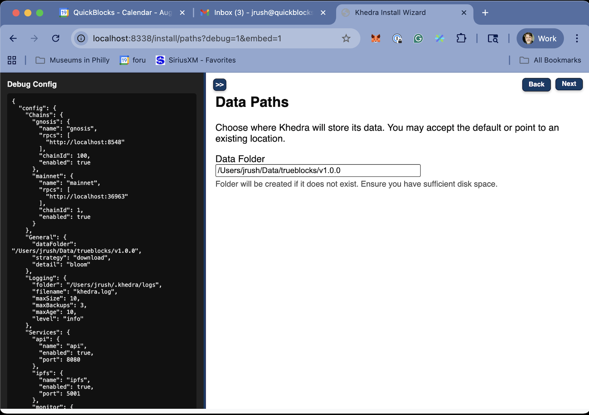

# Paths Screen

## Purpose

- Allows users to configure high-level application settings
- Sets up crucial file paths for data storage

## Key Features

- Define the main data folder location with path expansion support
- We suggest you use an external SSD drive of at least 2TB. Faster is better.
- Options for path expansion (supporting $HOME and ~/ notation)
- Input validation for directory existence and write permissions

## Configuration Options

This screen presents these key configuration options:

1. **Data Folder**: Where Khedra stores all index and cache data
   - Default: `~/.khedra/data`
   - Must be a writable location with sufficient disk space
