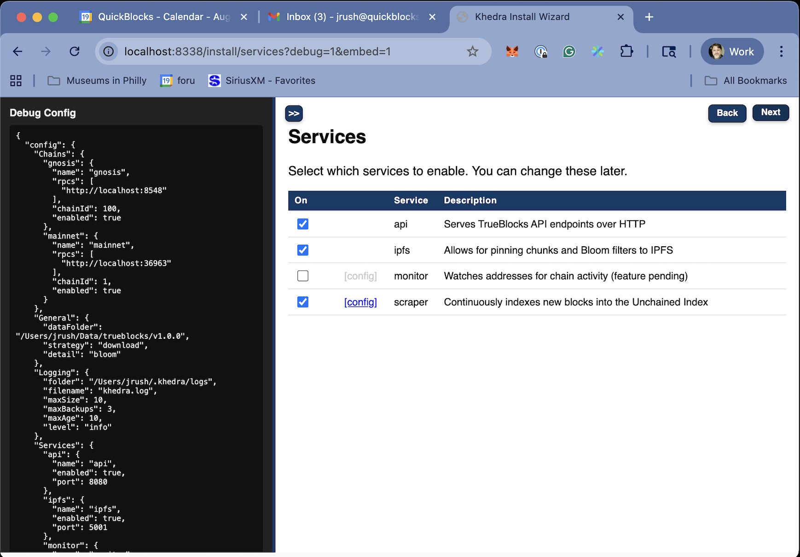

# Services Screen

## Purpose

- Enables users to select and configure Khedra's core services
- Explains the relationship between the services
- Ensures at least one service is enabled for proper functionality

## Available Services

Khedra offers five core services that work together:

1. **Control Service**: Management endpoints for the other services
   - Always enabled - no control
   - Provides a central API for managing other services

2. **Scraper Service**: Builds and maintains the Unchained Index
   - Processes blocks to extract address appearances
   - Configurable batch size and sleep interval

3. **Monitor Service**: Tracks specific addresses of interest
   - Provides notifications for address activities
   - Configurable batch size and sleep interval

4. **API Service**: REST API for data access
   - Configurable port number
   - Provides endpoints for querying the index and monitors

5. **IPFS Service**: Distributed data sharing
   - Enables sharing and downloading index data
   - Configurable port number

## Configuration Parameters

For each service, you can configure:

- **Enabled/Disabled**: Toggle the service on or off

In the config file:

- **Port numbers**: For services that expose network endpoints
- **Batch size**: Number of blocks processed in one batch (for scraper/monitor)
- **Sleep interval**: Time to wait between batches (for scraper/monitor)
- **Resource limits**: Memory and CPU constraints
