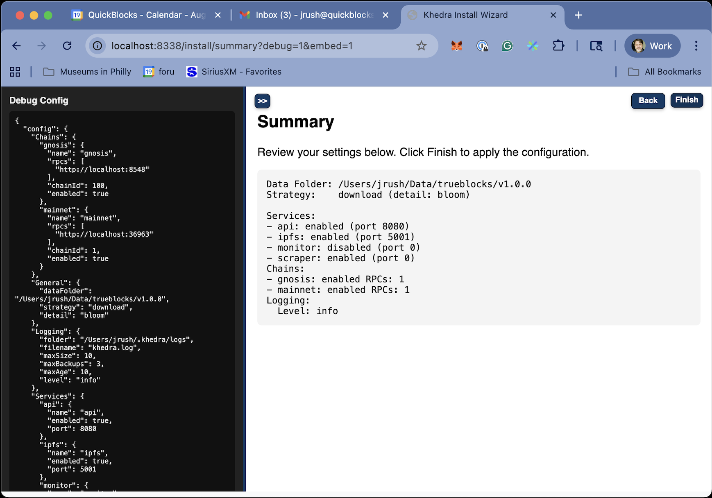

# Summary Screen

## Purpose

- Provides a review of all configured settings
- Offers a final chance to make adjustments before saving
- Summarizes the configuration in a clear, readable format

## Configuration Summary Display

The summary screen presents the configuration organized by section:

1. **General Settings**
   - Data folder location
   - Download strategy
   - Logging configuration

2. **Services Configuration**
   - Enabled/disabled status for each service
   - Port numbers and key parameters
   - Resource allocations

3. **Chain Settings**
   - Configured blockchains
   - RPC endpoints
   - Chain-specific settings

When the user chooses to finish, the wizard writes the configuration to `~/.khedra/config.yaml` by default, or to an alternative location if specified during the process.

If the user chooses to edit the file directly (`khedra config edit`), the wizard will invoke the system's default editor (or the editor specified in the EDITOR environment variable) and then reload the configuration after editing.
