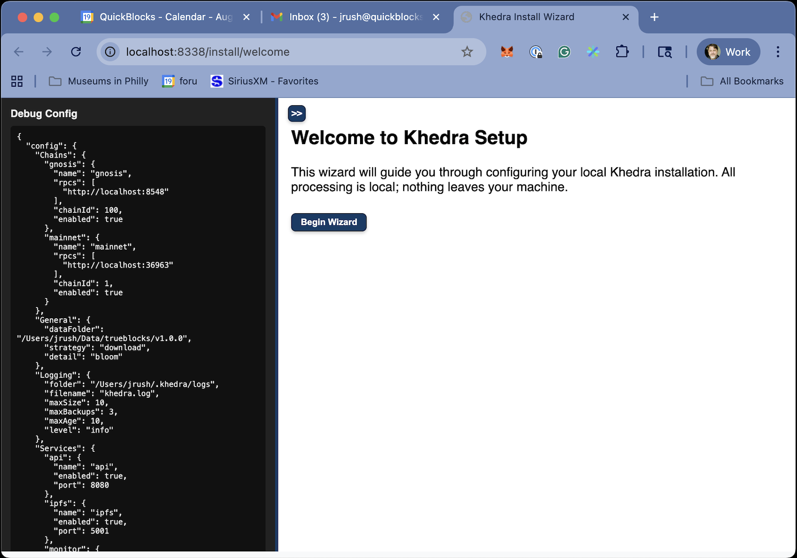

# Welcome Screen

## Purpose

- Introduces the wizard to the user
- Orients the user to the configuration process
- Provides clear navigation instructions

The welcome screen serves as the entry point to the configuration process, designed to be approachable while providing clear direction on how to proceed. The sidebar to the left show the current contents of the configuration file. You may show it or hide with the expander.
