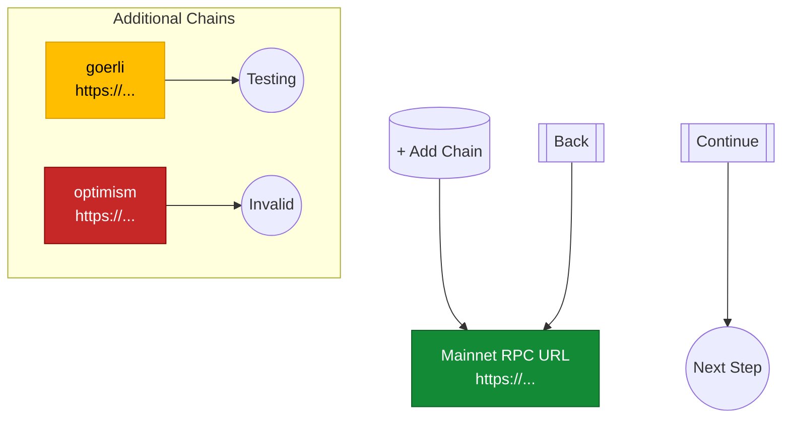
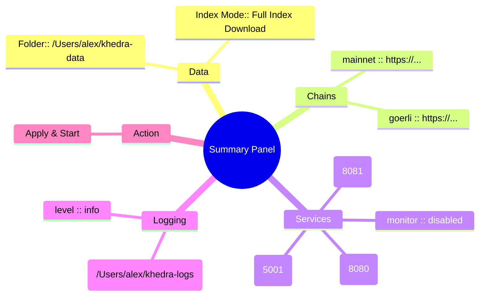
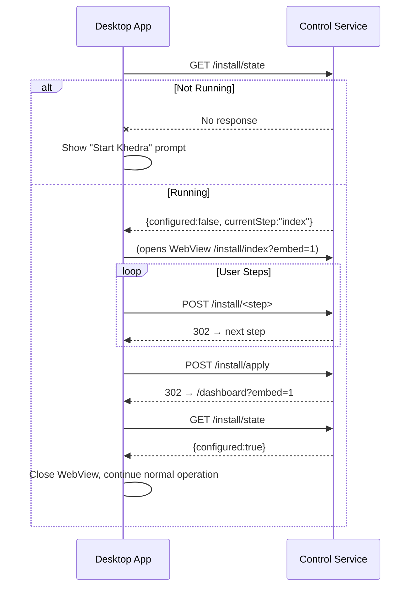

# HTML Installation Flow (Local-First Wizard)

Date: 2025-08-14 (refined)

Local-First Principle (Condensed):
- Serve only on loopback / future unix socket. No remote callbacks, telemetry, or external CDNs.
- All validation & persistence local; JS only for progressive enhancement.
- Embed mode never expands exposure.

Cross-References: `Dashboard.md`, `Embedding.md`.

## 1. Objectives
- Replace terminal wizard screens with a minimal static HTML flow served by the control service.
- Provide a single, linear (one-path) setup experience from “not configured” to “daemon configured & restarted with new settings”.
- Maintain zero external dependencies (no JS build tooling; vanilla HTML/CSS + tiny inline JS for validation).
- Keep pages bookmark-safe (pure GET for navigation; POST only for mutations / saves).
- Ensure discoverability: if config incomplete, control service root (`/`) redirects to installation flow.
- Design every page so it may be embedded (unchanged) inside a desktop WebView (Wails/Go/React/Mantine) with optional chrome suppression.

## 2. High-Level Flow (Target)


## 3. Page Details
### 3.1 Common UI Elements
- Header: Khedra logo/text + “Local Setup” subtitle.
- Progress bar (7 segments). Highlight current step.
- Footer: “All processing is local. Nothing leaves your machine.” + version.
- Form pattern: POST to `/install/<step>`; server validates, persists partial config, redirects (PRG) to next step.
- CSRF not required (loopback only) but include a hidden `session` token to prevent accidental replays.

### 3.2 Step 1: Welcome (`GET /install/welcome`)
Purpose: Establish context & start wizard.
Contents:
- Brief explanation of local-first philosophy.
- Button: “Begin Setup” (form POST to `/install/welcome`).
Fallback: If config already valid → redirect `/dashboard`.

### 3.3 Step 2: Data Paths (`GET /install/paths`)
Fields:
- Data Folder (text) – default `~/khedra-data`
- Confirm available space hint after user leaves field (JS checks `navigator.storage.estimate()` fallback static note).
Validation:
- Resolve `~` and `$HOME` server-side.
- Create folder if missing; show message if created.

### 3.4 Step 3: Index Mode (`GET /install/index`)
Fields (radio):
- Download Bloom Only (smaller, slower queries)
- Download Full Index (large, fast queries)
- Build From Scratch (slowest, highest trust)
Conditional Note: If “Build From Scratch” chosen, skip bloom/index detail.

### 3.5 Step 4: Chains & RPC (`GET /install/chains`)
Minimal path approach:
- Mainnet RPC (required) input.
- Additional Chains (dynamic repeater): “Add Chain” button reveals pair (Chain Name, RPC URL).
Client JS adds new row (template clone). No external libs.
Validation server-side:
- For each RPC: attempt lightweight `eth_blockNumber` (timeout 2s). Show inline status (green check / red X) via AJAX fetch `/install/rpc-test?url=...`.
Simplification: All chain entries enabled implicitly; removal = delete row.

### 3.6 Step 5: Services (`GET /install/services`)
Checkboxes (default suggested state):
- Scraper (enabled)
- Monitor (disabled)
- API (enabled)
- IPFS (enabled)
Ports Section (if service enabled): inline numeric input (pre-filled default, e.g. API 8080, IPFS 5001 if that’s actual).
Validation: Real-time uniqueness check among chosen ports.

### 3.7 Step 6: Logging (`GET /install/logging`)
Fields:
- Log to File (checkbox)
- Log Folder (text, hidden unless checked)
- Log Level (select: debug, info, warn, error)
If folder missing, create (with notice).

### 3.8 Step 7: Summary (`GET /install/summary`)
Display read-only panel grouping: General, Index Strategy, Chains, Services & Ports, Logging.
Buttons:
- “Back” (link to previous)
- “Apply & Start” (POST to `/install/apply`)

### 3.9 Apply (POST /install/summary)
Server Actions:
1. Final validation.
2. Atomic write of final `config.yaml` (temp + rename, backup previous).
3. (If daemon already running) instruct user to restart (future graceful reload).
4. Redirect to `/dashboard`.

### 3.10 Re-run Setup (Post-Install Edit)
Summary becomes review page. Section edits reuse step endpoints; draft accumulates; apply overwrites config. Optional reset (future) archives existing config and restarts at welcome.

## 4. Visual Wireframes (Mermaid)
### 4.1 Progress Header
Shows the linear 7-step wizard with styling for done/current/pending states (single source of truth for progress component classes).


### 4.2 Form Layout (Example: Chains)
Illustrates a single step form: primary required chain at top, additional chains grouped, status badges (valid/testing/invalid), and navigation controls.


### 4.3 Summary
Mindmap-style overview grouping the final read-only values before Apply; each branch corresponds to a section collected earlier.


## 5. Endpoints (Wizard & Related)
 
| Method | Path | Purpose |
|--------|------|---------|
| GET | / | Redirect to /install/welcome if not configured else /dashboard |
| GET | /install/welcome | Welcome page |
| POST | /install/welcome | Start session, redirect next step |
| GET | /install/paths | Data paths form |
| POST | /install/paths | Persist partial paths config |
| GET | /install/index | Index mode selection |
| POST | /install/index | Persist index strategy |
| GET | /install/chains | Chains form |
| POST | /install/chains | Persist chains (replace set) |
| GET | /install/services | Services + ports |
| POST | /install/services | Persist services config |
| GET | /install/logging | Logging config |
| POST | /install/logging | Persist logging config |
| GET | /install/summary | Summary / review |
| POST | /install/summary | Finalize config & exit install mode |
| GET | /install/rpc-test | (AJAX) Validate RPC URL (query param) |
| GET | /install/state | JSON: installation state (`configured`, `currentStep`, `sessionId`) |
| GET | /install/welcome?embed=1 | Welcome (embed mode: minimal chrome) |
| GET | /install/*?embed=1 | Any step in embed mode (header/footer suppressed) |
| GET | /dashboard | Post-install dashboard (see Dashboard.md) |
| GET | /config.yaml | Download rendered config |

Install Mode Toggle: Control service considers system “not configured” when `config.yaml` absent or missing required mainnet RPC.

Embedding / View Mode Toggle: Presence of `?embed=1` (or header `X-Khedra-Embed: 1`) instructs server to:
- Omit global header/footer & marketing copy.
- Collapse progress bar into a single inline row with `data-step` attributes (desktop host can restyle).
- Suppress external navigation links (open config, re-run setup) unless explicitly allowed.

## 6. State & Atomic Persistence
- Draft file `config.draft.json` (under data dir `~/.khedra`).
- Atomic write: temp file → fsync → rename.
- Mutex around draft read-modify-write.
- Single active SessionID; conflicting POST returns 409 (takeover allowed after inactivity ≥5m).
- Apply: backup existing config → rename temp → delete draft only on success.
- Corrupt draft archived `config.draft.json.corrupt-<timestamp>` then earliest step resumes.

## 7. Validation Summary
 
| Field | Validation |
|-------|------------|
| Data Folder | Expand ~, create if missing, writable check |
| Index Mode | One of bloom/index/scratch |
| Mainnet RPC | Reachable, basic JSON-RPC call succeeds |
| Additional Chain Name | Alphanumeric + dashes; uniqueness |
| Additional Chain RPC | Same test as mainnet |
| Service Ports | Integer 1024–65535, unique among enabled services |
| Log Folder | Same as Data Folder rules if logging to file |
| Log Level | Enum: debug/info/warn/error |

## 8. Minimal HTML / CSS Principles
- One `styles.css` (~2KB) with CSS variables for spacing/colors.
- No external fonts; system font stack.
- Inline `<script>` per page (<1KB) for small interactive bits (add chain row, inline validation fetch).
- Graceful degradation: JS absent still allows serial submission (page reload adds a single blank chain row link, etc.).

## 9. Migration Plan
1. Implement detection logic in control service to serve install flow when config invalid.
2. Build minimal templating helper (Go `html/template`).
3. Implement endpoints sequentially.
4. Replace CLI `khedra init` to simply open `http://127.0.0.1:<control-port>/install/welcome` (print URL) and exit.
5. Mark old wizard path deprecated; remove after one release.
6. Introduce `/install/state` & `?embed=1` once basic HTML pages stable so desktop apps can adopt without waiting for full deprecation cycle.

## 10. Success Criteria
- Fresh install: user runs `khedra init` → browser guided flow completes without terminal interaction.
- Config persists & daemon starts with chosen settings.
- Re-running `khedra init` after completion opens dashboard (not wizard).
- Arbitrary interruption mid-flow resumes at correct next step.
- Desktop application (Wails) can:
  - On first launch: request `/install/state` → if `configured:false` open internal webview to `/install/welcome?embed=1`.
  - After completion: webview navigates to `/dashboard?embed=1` or closes and app proceeds.
  - On subsequent launches: skip UI when `/install/state` returns `configured:true`.

## 11. Future Enhancements (Still Local)
Unchanged list retained (dark mode, autosave indicator, theming tokens, disk estimation, folder picker).

### 11.1 Minimal Inline JS (Browser + Desktop Shared)
```html
<script>
async function refreshDashboard(){
  const r = await fetch('/dashboard/state');
  if(!r.ok) return;
  const data = await r.json();
  // Update service rows
  data.services.forEach(s => {
    const row = document.querySelector(`[data-service="${s.name}"]`);
    if(row){
      row.querySelector('[data-col="state"]').textContent = s.state;
      row.querySelector('[data-col="port"]').textContent = s.port || '-';
    }
  });
}
setInterval(refreshDashboard, 5000);
</script>
```
In desktop embed mode polling can be disabled (shell triggers manual refresh after actions) by adding `?embed=1&autoRefresh=0`.

### 11.2 Accessibility & Performance Notes
- Use semantic `<table>` for service status; ARIA roles only where needed.
- Prefer deferred log tail loading (JS fetch after initial paint) to avoid blocking.
- Cache `/dashboard/state` for ~1s server-side to smooth bursts.

### 11.3 Future Enhancements (Dashboard Specific)
- SSE stream for service state transitions.
- Disk usage bar (asynchronous calculation off main request path).
- Quick actions: “Pause All”, “Unpause All” (batched POST).
- Inline chain RPC latency badges.

---

## 12. Embedding & Re‑Entrancy (Essentials)

### 12.1 Current vs Eventual Modes
Current implementation: a **stand‑alone lightweight HTML server** (inside the control service) renders the installation wizard when configuration is incomplete. It must support *re‑entrancy*: user can stop midway, come back later, and resume.

Eventual extension: **desktop applications (Wails/Go/React/Mantine)** embed the **same HTML pages** inside a WebView to guarantee identical logic, eliminating dual maintenance (no separate React wizard). The desktop host just supplies a container window and optional styling overrides.

### 12.2 Design Principles for Embedding
- Single Source: All authoritative UI content lives in server templates; desktop never forks wizard logic.
- Stateless Pages: Each page derives state from the draft config on load; no hidden cross‑page JS global required—enables reload resilience.
- Progressive Enhancement: Minimal inline JS (feature detection) so desktop host can disable scripts for auditing if desired.
- Chrome Suppression: `?embed=1` removes header/footer and uses semantic containers (`<main data-step="chains">`).
- Theming Hooks: Each major element receives `data-role` attributes (`data-role="progress"`, `data-role="actions"`) to allow CSS injection by desktop container.

### 12.3 State Endpoint (`/install/state`)
Response (example):
```json
{
  "configured": false,
  "currentStep": "chains",      // one of: welcome|paths|index|chains|services|logging|summary
  "sessionId": "3f9c7b6e",
  "version": "vX.Y.Z",
  "schema": 1
}
```
Usage:
1. Desktop app on startup calls endpoint (timeout 750ms).
2. If network error → assume daemon not running; prompt user to start Khedra.
3. If `configured:false` → open embedded webview to `/install/<currentStep>?embed=1`.
4. Poll every 2–3s (or listen via future SSE) to detect transition to `configured:true`.

### 12.4 Re‑Entrancy Flow (Desktop)


### 12.5 Failure / Recovery Scenarios
 
| Scenario | Behavior | Desktop Action |
|----------|----------|----------------|
| Draft file corrupted | Server resets wizard to earliest incomplete step | Reload welcome & notify user |
| Step validation fails | Returns page with inline error (422) | Keep webview; highlight fields |
| Daemon stops mid‑install | Subsequent state calls fail | Prompt to restart; state preserved in draft file |
| Version upgrade changes schema | Server migrates draft (best effort) or restarts at first step | Display migration notice |

### 12.6 Minimal CSS Contract
Expose a base stylesheet with CSS variables (e.g. `--kb-spacing-1`, `--kb-color-accent`) so desktop host can override by injecting `<style>` after the link tag when in embed mode.

### 12.7 Local Exposure Guarantee
All installation and embedding endpoints must bind to loopback (or future unix socket) only. Desktop wrapper must not proxy them externally. This enforces the local‑first directive while enabling rich UI integration.

### 12.8 Future SSE (Optional)
Potential `/install/events` SSE stream emitting `{step:"services"}`, `{configured:true}` to reduce polling; out of scope for first pass but placeholders in code can ease later addition.

### 12.9 Removal of Terminal Wizard
Once desktop embedding stable and adoption confirmed, remove CLI interactive wizard screens; `khedra init` becomes a lightweight command that starts (if not running) then prints the local URL (and optionally opens the system browser).

---

---
Prepared for implementation discussion and (later) coordinated documentation overhaul.

## 13. Documentation Overhaul Plan (Moved)
Relocated to `DocumentationOverhaulPlan.md` for clarity and to keep this wizard spec focused.

## 14. Desktop Embedding Implementation Playbook (Moved)
See `Embedding.md` for full playbook.

Consolidates embedding details into a concrete developer guide suitable for the forthcoming documentation rewrite.

### 14.1 Goals
- Zero fork: desktop container uses the exact served HTML pages.
- Fast detection of install state (sub‑second) without speculative retries.
- Simple, observable transitions from not configured → configured → dashboard.

### 14.2 Minimal Startup Algorithm (Pseudocode)
```ts
async function ensureKhedraReady(){
  const URL = 'http://127.0.0.1:8338'; // control port from config / discovery
  try {
    const r = await fetch(URL + '/install/state', {cache:'no-store'});
    if(!r.ok) throw new Error('bad status');
    const st = await r.json();
    if(!st.configured){
      openWebView(URL + '/install/' + st.currentStep + '?embed=1');
      await waitUntilConfigured(URL); // polls or SSE future
    }
    openWebView(URL + '/dashboard?embed=1');
  } catch(e){
    showStartDaemonHint();
  }
}
```

`waitUntilConfigured` can poll `/install/state` every 2–3s (backoff after first 5 tries). Abort if daemon stops responding.

### 14.3 Wails (Go) Skeleton
```go
// inside startup
func (a *App) BootKhedra() {
    state, err := getInstallState()
    if err != nil { a.emit("khedra:notRunning", nil); return }
    if !state.Configured {
        a.OpenWebView(fmt.Sprintf("%s/install/%s?embed=1", baseURL(), state.CurrentStep))
        go a.pollUntilConfigured()
        return
    }
    a.OpenWebView(baseURL() + "/dashboard?embed=1")
}
```

### 14.4 Embed Mode Styling Contract
- `<body data-embed="1">` present.
- Panels may be individually hidden: `[data-panel="about"]`, header.
- Desktop app may inject a `<style>` tag overriding CSS variables (no DOM mutation required).

### 14.5 Handling Actions
 
| Action | Desktop Option | Note |
|--------|----------------|------|
| Pause/Unpause | Forward webview button clicks OR re-implement native fetch to `/control/pause` | Keep optimistic UI minimal |
| Re-run Setup | Navigate webview to `/install/summary?embed=1` | After apply, redirect to dashboard automatically |
| Download Config | Let browser/webview handle; optionally copy file to user location | Use content-disposition |
| Refresh | Trigger JS `refreshDashboard()` or fetch JSON natively | Avoid double polling |

### 14.6 Error Surfaces
- If `/install/state` 404: treat as older version (show upgrade advisory).
- If network ECONNREFUSED: show “Start Khedra” with a retry button.
- If JSON parse error: log diagnostic, surface minimal fallback (“open in browser: …”).

### 14.7 Security / Locality Affirmations
- Never expose these endpoints beyond loopback.
- Desktop must not proxy wizard externally (no reverse tunneling for support).
- No auto-open of external links without explicit user gesture.

### 14.8 Testing Matrix
 
| Scenario | Expectation |
|----------|-------------|
| Fresh install, daemon running | Wizard step served in embed mode |
| Partial draft present | Resumes at stored step |
| Completed install | Direct dashboard load |
| Daemon absent | Start prompt UI |
| Pause/Unpause action | State change reflected within 1 poll cycle |

### 14.9 Future Desktop Enhancements
- SSE integration to reduce polling.
- Native notifications on service failures.
- Offline/hibernation detection to pause polling when app unfocused.

---
