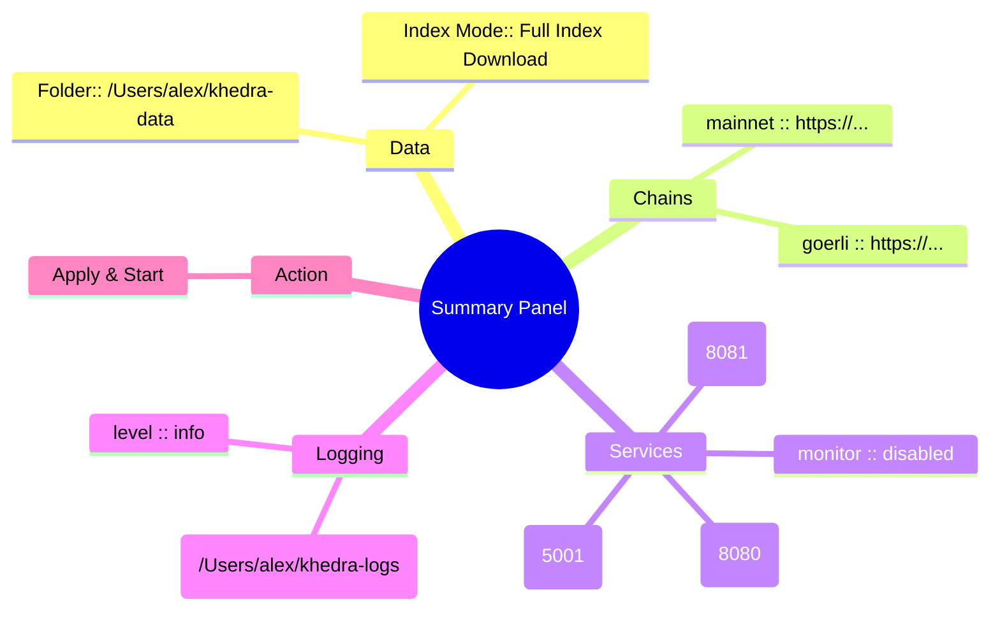
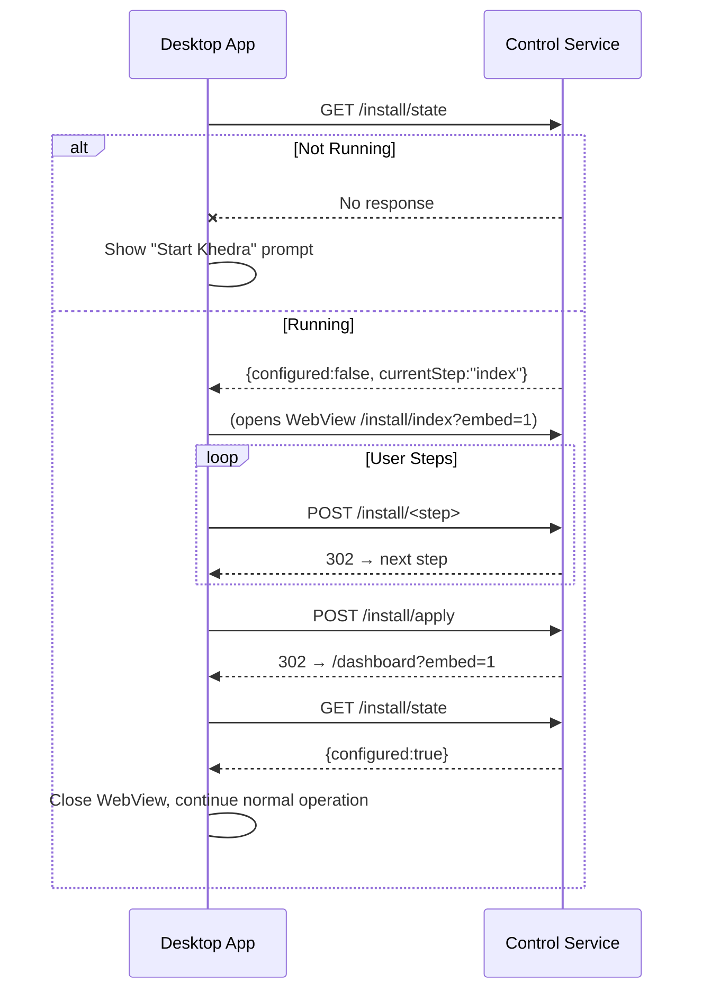

# HTML Installation Flow Proposal (Local-First Control UI)

Date: 2025-08-14

Primary Directive: 100% local-first. All interaction occurs on localhost (or future unix domain socket) – never remote.

## 1. Objectives
- Replace terminal wizard screens with a minimal static HTML flow served by the control service.
- Provide a single, linear (one-path) setup experience from “not configured” to “daemon configured & restarted with new settings”.
- Maintain zero external dependencies (no JS build tooling; vanilla HTML/CSS + tiny inline JS for validation).
- Keep pages bookmark-safe (pure GET for navigation; POST only for mutations / saves).
- Ensure discoverability: if config incomplete, control service root (`/`) redirects to installation flow.
- Design every page so it may be embedded (unchanged) inside a desktop WebView (Wails/Go/React/Mantine) with optional chrome suppression.

## 2. High-Level Flow


## 3. Page Details
### 3.1 Common UI Elements
- Header: Khedra logo/text + “Local Setup” subtitle.
- Progress bar (7 segments). Highlight current step.
- Footer: “All processing is local. Nothing leaves your machine.” + version.
- Form pattern: POST to `/install/<step>`; server validates, persists partial config, redirects (PRG) to next step.
- CSRF not required (loopback only) but include a hidden `session` token to prevent accidental replays.

### 3.2 Step 1: Welcome (`GET /install/welcome`)
Purpose: Establish context & start wizard.
Contents:
- Brief explanation of local-first philosophy.
- Button: “Begin Setup” (form POST to `/install/welcome`).
Fallback: If config already valid → redirect `/dashboard`.

### 3.3 Step 2: Data Paths (`GET /install/paths`)
Fields:
- Data Folder (text) – default `~/khedra-data`
- Confirm available space hint after user leaves field (JS checks `navigator.storage.estimate()` fallback static note).
Validation:
- Resolve `~` and `$HOME` server-side.
- Create folder if missing; show message if created.

### 3.4 Step 3: Index Mode (`GET /install/index`)
Fields (radio):
- Download Bloom Only (smaller, slower queries)
- Download Full Index (large, fast queries)
- Build From Scratch (slowest, highest trust)
Conditional Note: If “Build From Scratch” chosen, skip bloom/index detail.

### 3.5 Step 4: Chains & RPC (`GET /install/chains`)
Minimal path approach:
- Mainnet RPC (required) input.
- Additional Chains (dynamic repeater): “Add Chain” button reveals pair (Chain Name, RPC URL).
Client JS adds new row (template clone). No external libs.
Validation server-side:
- For each RPC: attempt lightweight `eth_blockNumber` (timeout 2s). Show inline status (green check / red X) via AJAX fetch `/install/rpc-test?url=...`.
Simplification: All chain entries enabled implicitly; removal = delete row.

### 3.6 Step 5: Services (`GET /install/services`)
Checkboxes (default suggested state):
- Scraper (enabled)
- Monitor (disabled)
- API (enabled)
- IPFS (enabled)
Ports Section (if service enabled): inline numeric input (pre-filled default, e.g. API 8080, IPFS 5001 if that’s actual).
Validation: Real-time uniqueness check among chosen ports.

### 3.7 Step 6: Logging (`GET /install/logging`)
Fields:
- Log to File (checkbox)
- Log Folder (text, hidden unless checked)
- Log Level (select: debug, info, warn, error)
If folder missing, create (with notice).

### 3.8 Step 7: Summary (`GET /install/summary`)
Display read-only panel grouping: General, Index Strategy, Chains, Services & Ports, Logging.
Buttons:
- “Back” (link to previous)
- “Apply & Start” (POST to `/install/apply`)

### 3.9 Step 8: Apply & Start (`POST /install/apply`)
Server Actions:
1. Final validation.
2. Persist config.yaml.
3. (If daemon already running) instruct user to restart OR optionally send internal signal for graceful restart (future; keep manual now).
4. Redirect to `/dashboard`.

### 3.10 Dashboard (`GET /dashboard`)
After install or on subsequent visits.
Sections:
- Service Status Table (Name | State | Actions [Pause/Unpause]).
- Chains (Name | Height? – if available later; else just list).
- Paths quick view.
- Buttons: Open Config (downloads current YAML), Re-run Setup (goes to first differing step but ask confirmation).

## 4. Visual Wireframes (Mermaid)
### 4.1 Progress Header
```mermaid
flowchart LR
  subgraph Progress_Bar[Progress (Step 3 of 7)]
    S1([1 Welcome]):::done --> S2([2 Paths]):::done --> S3([3 Index]):::current --> S4([4 Chains]):::pending --> S5([5 Services]):::pending --> S6([6 Logging]):::pending --> S7([7 Summary]):::pending
  end
  classDef done fill:#0d3b66,color:#ffffff,stroke:#06223b,stroke-width:1px;
  classDef current fill:#138a36,color:#ffffff,stroke:#0e5e25,stroke-width:1px;
  classDef pending fill:#d3dce6,color:#1b2b34,stroke:#9fb3c8,stroke-width:1px;
```

### 4.2 Form Layout (Example: Chains)
```mermaid
flowchart TB
  title Chains & RPC Endpoints (Example)
  MAIN["Mainnet RPC URL\nhttps://..."]:::valid
  subgraph Additional Chains
    G["goerli\nhttps://..."]:::testing --> Gs((Testing))
    O["optimism\nhttps://..."]:::invalid --> Os((Invalid))
  end
  ADD[(+ Add Chain)] --> MAIN
  CONTINUE[[Continue]] --> S_NEXT((Next Step))
  BACK[[Back]] --> MAIN

  classDef valid fill:#138a36,color:#fff,stroke:#0e5e25;
  classDef testing fill:#ffbf00,color:#000,stroke:#d99a00;
  classDef invalid fill:#c62828,color:#fff,stroke:#8e0000;
  class MAIN valid;
  class G testing;
  class O invalid;
```

### 4.3 Summary


## 5. API Endpoints (Installation Mode)
 
| Method | Path | Purpose |
|--------|------|---------|
| GET | / | Redirect to /install/welcome if not configured else /dashboard |
| GET | /install/welcome | Welcome page |
| POST | /install/welcome | Start session, redirect next step |
| GET | /install/paths | Data paths form |
| POST | /install/paths | Persist partial paths config |
| GET | /install/index | Index mode selection |
| POST | /install/index | Persist index strategy |
| GET | /install/chains | Chains form |
| POST | /install/chains | Persist chains (replace set) |
| GET | /install/services | Services + ports |
| POST | /install/services | Persist services config |
| GET | /install/logging | Logging config |
| POST | /install/logging | Persist logging config |
| GET | /install/summary | Read-only summary |
| POST | /install/apply | Finalize config & exit install mode |
| GET | /install/rpc-test | (AJAX) Validate RPC URL (query param) |
| GET | /install/state | JSON: installation state (`configured`, `currentStep`, `sessionId`) |
| GET | /install/welcome?embed=1 | Welcome (embed mode: minimal chrome) |
| GET | /install/*?embed=1 | Any step in embed mode (header/footer suppressed) |
| GET | /dashboard | Post-install dashboard |
| GET | /config.yaml | Download rendered config |

Install Mode Toggle: Control service determines “not configured” when `config.yaml` absent or missing required mainnet RPC.

Embedding / View Mode Toggle: Presence of `?embed=1` (or header `X-Khedra-Embed: 1`) instructs server to:
- Omit global header/footer & marketing copy.
- Collapse progress bar into a single inline row with `data-step` attributes (desktop host can restyle).
- Suppress external navigation links (open config, re-run setup) unless explicitly allowed.

## 6. State Handling Strategy
- Use a lightweight in-memory draft struct mirroring `types.Config` plus a `SessionID`.
- Persist incremental changes to a temporary `config.draft.json` in `~/.khedra/` after every POST.
- On apply, validate & transform draft → final `config.yaml`; delete draft file.
- If user abandons mid-way, returning to `/` resumes from last completed step (detected by filled fields in draft).
- `GET /install/state` always returns authoritative progress so an embedding desktop app can poll once at startup instead of parsing HTML.

## 7. Validation Summary
 
| Field | Validation |
|-------|------------|
| Data Folder | Expand ~, create if missing, writable check |
| Index Mode | One of bloom/index/scratch |
| Mainnet RPC | Reachable, basic JSON-RPC call succeeds |
| Additional Chain Name | Alphanumeric + dashes; uniqueness |
| Additional Chain RPC | Same test as mainnet |
| Service Ports | Integer 1024–65535, unique among enabled services |
| Log Folder | Same as Data Folder rules if logging to file |
| Log Level | Enum: debug/info/warn/error |

## 8. Minimal HTML / CSS Principles
- One `styles.css` (~2KB) with CSS variables for spacing/colors.
- No external fonts; system font stack.
- Inline `<script>` per page (<1KB) for small interactive bits (add chain row, inline validation fetch).
- Graceful degradation: JS absent still allows serial submission (page reload adds a single blank chain row link, etc.).

## 9. Migration Plan
1. Implement detection logic in control service to serve install flow when config invalid.
2. Build minimal templating helper (Go `html/template`).
3. Implement endpoints sequentially.
4. Replace CLI `khedra init` to simply open `http://127.0.0.1:<control-port>/install/welcome` (print URL) and exit.
5. Mark old wizard path deprecated; remove after one release.
6. Introduce `/install/state` & `?embed=1` once basic HTML pages stable so desktop apps can adopt without waiting for full deprecation cycle.

## 10. Success Criteria
- Fresh install: user runs `khedra init` → browser guided flow completes without terminal interaction.
- Config persists & daemon starts with chosen settings.
- Re-running `khedra init` after completion opens dashboard (not wizard).
- Arbitrary interruption mid-flow resumes at correct next step.
- Desktop application (Wails) can:
  - On first launch: request `/install/state` → if `configured:false` open internal webview to `/install/welcome?embed=1`.
  - After completion: webview navigates to `/dashboard?embed=1` or closes and app proceeds.
  - On subsequent launches: skip UI when `/install/state` returns `configured:true`.

## 10a. Dashboard Specification (Post-Install)

The dashboard is the persistent local control panel once configuration is complete. It must be:
- Read‑only for core config values (link to edit triggers external editor or future inline edit flow).
- Actionable for pause/unpause of pausable services.
- Embeddable (chrome suppression via `?embed=1`).
- Zero polling heavy; initial load + optional light refresh (manual refresh button or SSE later).

### 10a.1 Functional Areas
1. Service Status: list all services (control, scraper, monitor, api, ipfs) with state (running/paused/not enabled) + action buttons where applicable.
2. Chains: enabled chains with basic RPC health (last block height fetched; fallback “reachable/unreachable”).
3. Paths: data folder, log folder, index size (if quickly computable) – avoid expensive directory walk on each request (cache size asynchronously).
4. Recent Log Tail (optional / collapsible): last N lines if file logging enabled.
5. Actions: Re-run setup (opens `/install/summary?embed=1` with a confirm), Open config.yaml (download), Restart hint (manual for now).
6. About: version, build info, local‑first statement.

### 10a.2 Data Endpoint
`GET /dashboard/state` returns JSON driving the page (and used by embedded desktop app for reactive updates):
```json
{
  "version": "vX.Y.Z",
  "services": [
    {"name":"control","state":"running","pausable":false,"port":8338},
    {"name":"scraper","state":"running","pausable":true,"port":8081},
    {"name":"monitor","state":"paused","pausable":true,"port":8082},
    {"name":"api","state":"running","pausable":false,"port":8080},
    {"name":"ipfs","state":"running","pausable":false,"port":5001}
  ],
  "chains": [
    {"name":"mainnet","enabled":true,"rpc":"https://...","height":19123456,"reachable":true},
    {"name":"goerli","enabled":true,"rpc":"https://...","height":1234567,"reachable":true}
  ],
  "paths": {"data":"/Users/alex/khedra-data","logs":"/Users/alex/khedra-logs"},
  "logTail": ["2025-08-14T12:05:01Z service scraper cycle ..."],
  "pausedSummary": {"paused": ["monitor"], "totalPausable":2},
  "schema": 1
}
```

### 10a.3 Dashboard Wireframe (Screen Layout)
Mermaid flowcharts are not ideal for true screen layout, so this section uses:
1. ASCII proportional wireframe
2. HTML semantic skeleton (embed-friendly)
3. Minimal CSS Grid layout
4. Notes for generating a PNG mock automatically

#### 10a.3.1 ASCII Wireframe (Desktop ≥ 1200px)
```
┌──────────────────────────────────────────────────────────────────────────────────────────────┐
│ Header: Khedra • vX.Y.Z • Local-First Only                                                   │
├────────────────────────────────┬────────────────────────────────┬────────────────────────────┤
│ Service Status                 │ Chains                         │ Actions                    │
│ ─────────────────────────────  │ ─────────────────────────────  │ ─────────────────────────  │
│ control   running    -         │ mainnet  height 19123456   ✓   │ Re-run Setup               │
│ scraper   running    8081 [⏸]  │ goerli   height 1234567    ✓   │ Download cfg               │
│ monitor   paused     8082 [▶]  │                                │ Refresh                    │
│ api       running    8080  -   │                                │                            │
│ ipfs      running    5001  -   │                                │                            │
├────────────────────────────────┴───────────────┬────────────────┴────────────────────────────┤
│ Paths & Storage                                │ About / Build / Local Policy                │
│ data: /Users/...  (size: 142GB)                │ commit: abc1234                             │
│ logs: /Users/...  (size: 12MB)                 │ build: 2025-08-14                           │
├────────────────────────────────────────────────┴─────────────────────────────────────────────┤
│ Log Tail (last 10)                                                                           │
│ 12:05:01 scraper cycle ...                                                                   │
│ 12:05:02 monitor paused                                                                      │
└──────────────────────────────────────────────────────────────────────────────────────────────┘
```

#### 10a.3.2 Responsive Adjustments
 
| Breakpoint | Layout Change |
|------------|---------------|
| ≥ 1400px | Three primary columns (Status, Chains, Actions) |
| 1000–1399px | Collapse Actions under Service Status (two columns) |
| 700–999px | Single column; Service Status accordion, others stacked |
| < 700px | All panels full-width, log tail collapsible by default |

#### 10a.3.3 HTML Skeleton (Embed Friendly)
```html
<body data-view="dashboard" data-embed="0">
  <header data-role="header">
    <h1>Khedra</h1><span data-role="version">vX.Y.Z</span>
    <span class="tag tag-local">Local-First</span>
  </header>
  <main data-layout="grid">
    <section data-panel="services">
      <h2>Services</h2>
      <table data-table="services">
        <thead><tr><th>Name</th><th>State</th><th>Port</th><th>Action</th></tr></thead>
        <tbody><!-- rows injected via JSON --></tbody>
      </table>
    </section>
    <section data-panel="chains">
      <h2>Chains</h2>
      <ul data-list="chains"></ul>
    </section>
    <aside data-panel="actions">
      <button data-action="rerun-setup">Re‑run Setup</button>
      <button data-action="download-config">Download Config</button>
      <button data-action="refresh">Refresh</button>
    </aside>
    <section data-panel="paths">
      <h2>Paths & Storage</h2>
      <dl>
        <dt>Data</dt><dd data-path="data"></dd>
        <dt>Logs</dt><dd data-path="logs"></dd>
        <dt>Index Size</dt><dd data-metric="indexSize">…</dd>
      </dl>
    </section>
    <section data-panel="about">
      <h2>About</h2>
      <p data-build="commit"></p>
      <p data-build="date"></p>
      <p>All processing is local.</p>
    </section>
    <section data-panel="logs" data-collapsible="true">
      <h2>Log Tail <button data-action="toggle-log">Toggle</button></h2>
      <pre data-log="tail"></pre>
    </section>
  </main>
</body>
```

Embed mode sets `data-embed="1"`, and the header + about panels can be hidden by CSS.

#### 10a.3.4 Minimal CSS Grid
```css
body { margin:0; font:14px/1.4 system-ui,-apple-system,Segoe UI,Roboto,sans-serif; color:#1d2730; }
[data-role="header"] { display:flex; gap:1rem; align-items:center; padding:.75rem 1.25rem; background:#0d3b66; color:#fff; }
.tag-local { background:#138a36; padding:.2rem .6rem; border-radius:4px; font-size:.75rem; letter-spacing:.5px; }
[data-layout="grid"] { display:grid; gap:1rem; padding:1rem; grid-template-columns:repeat(auto-fit,minmax(260px,1fr)); }
[data-panel] { background:#fff; border:1px solid #d7e1ea; border-radius:6px; padding: .75rem 1rem; box-shadow:0 1px 2px rgba(0,0,0,.04); }
[data-table="services"] { width:100%; border-collapse:collapse; font-size:.85rem; }
[data-table="services"] th, [data-table="services"] td { padding:.35rem .5rem; text-align:left; }
[data-table="services"] tbody tr:nth-child(even){ background:#f5f8fa; }
.state-running{ color:#138a36; font-weight:600; }
.state-paused{ color:#c77700; font-weight:600; }
.state-disabled{ color:#6b7885; }
@media (min-width:1200px){
  [data-panel="services"]{ grid-column:1 / span 1; }
  [data-panel="chains"]{ grid-column:2 / span 1; }
  [data-panel="actions"]{ grid-column:3 / span 1; }
  [data-panel="paths"]{ grid-column:1 / span 2; }
  [data-panel="about"]{ grid-column:3 / span 1; }
  [data-panel="logs"]{ grid-column:1 / span 3; }
}
@media (max-width:999px){ [data-panel="actions"]{ order:3; } }
[data-embed="1"] [data-panel="about"], [data-embed="1"] [data-role="header"] { display:none; }
```

#### 10a.3.5 PNG Generation (Optional Automation)
While this repo stays text‑only, a PNG mock can be auto‑generated locally:
1. Write the HTML skeleton + CSS to a temp file `dashboard_mock.html`.
2. Use a headless tool:
   - With Playwright: `npx playwright screenshot dashboard_mock.html dashboard.png --viewport-size=1400,1000`
   - Or wkhtmltoimage: `wkhtmltoimage dashboard_mock.html dashboard.png`
3. Place generated `dashboard.png` under `docs/` (not versioned if considered transient) and reference in external docs.

Embedders can likewise snapshot for integration tests to detect unintended layout changes.

#### 10a.3.6 Interaction Contract
 
| Element | Event | Endpoint | Result |
|---------|-------|----------|--------|
| Pause button | click | POST /control/pause | Row state → paused (optimistic) |
| Unpause button | click | POST /control/unpause | Row state → running |
| Refresh | click | GET /dashboard/state | Full table diff applied |
| Re‑run Setup | click | GET /install/summary?embed=1 | Launch wizard summary |
| Download Config | click | GET /config.yaml | Browser download |
| Toggle Log | click | n/a (local) | Collapse/expand log panel |

This explicit contract allows the Wails app to either keep the webview or replicate it natively later.

### 10a.4 Service Status Table Columns
 
| Column | Description | Notes |
|--------|-------------|-------|
| Name | Service identifier | order: control, scraper, monitor, api, ipfs |
| State | running / paused / disabled | color chips |
| Port | Listening port (if any) | `-` if none |
| Actions | Pause/Unpause buttons (pausable only) | POST `/control/pause`/`/control/unpause` |
| Last Change | Timestamp of last state transition | optional (omit if not tracked yet) |

### 10a.5 Embedding (Wails) Integration
Desktop flow after install:
1. Call `/dashboard/state` at app start; if 200, render native wrapper with a split view: left navigation (app-specific), right an embedded webview pointing to `/dashboard?embed=1`.
2. Optionally bypass webview for light mode: parse JSON and render a native React/Mantine replica. (Recommended to keep single source initially—direct embed.)
3. Pause/Unpause from native shell: send fetch to control endpoints (same as web) then either:
   - Optimistically update UI state, or
   - Re-fetch `/dashboard/state` to reconcile.
4. Re-run Setup button triggers `window.location.href='/install/summary?embed=1'` inside webview; shell listens for configuration completion via polling `/install/state`.

Chrome Suppression in embed mode:
- Hide header background image / large logos.
- Simplify spacing and fonts (inherit system from desktop app).
- Provide `data-embed="1"` on `<body>` for CSS overrides.

### 10a.6 Minimal Inline JS (Browser + Desktop Shared)
```html
<script>
async function refreshDashboard(){
  const r = await fetch('/dashboard/state');
  if(!r.ok) return;
  const data = await r.json();
  // Update service rows
  data.services.forEach(s => {
    const row = document.querySelector(`[data-service="${s.name}"]`);
    if(row){
      row.querySelector('[data-col="state"]').textContent = s.state;
      row.querySelector('[data-col="port"]').textContent = s.port || '-';
    }
  });
}
setInterval(refreshDashboard, 5000);
</script>
```
In desktop embed mode polling can be disabled (shell triggers manual refresh after actions) by adding `?embed=1&autoRefresh=0`.

### 10a.7 Accessibility & Performance Notes
- Use semantic `<table>` for service status; ARIA roles only where needed.
- Prefer deferred log tail loading (JS fetch after initial paint) to avoid blocking.
- Cache `/dashboard/state` for ~1s server-side to smooth bursts.

### 10a.8 Future Enhancements (Dashboard Specific)
- SSE stream for service state transitions.
- Disk usage bar (asynchronous calculation off main request path).
- Quick actions: “Pause All”, “Unpause All” (batched POST).
- Inline chain RPC latency badges.

---

## 11. Future Enhancements (Still Local)
- Optional dark mode CSS toggle.
- Progress autosave indicator.
- Unified theming token endpoint (`/ui/theme.css`) for desktop host override.
- Inline detection of approximate disk space consumption from chosen mode.
- Button to launch system file picker for folders (webkitdirectory fallback note if unsupported).

## 12. Embedding & Re‑Entrancy Architecture

### 12.1 Current vs Eventual Modes
Current implementation: a **stand‑alone lightweight HTML server** (inside the control service) renders the installation wizard when configuration is incomplete. It must support *re‑entrancy*: user can stop midway, come back later, and resume.

Eventual extension: **desktop applications (Wails/Go/React/Mantine)** embed the **same HTML pages** inside a WebView to guarantee identical logic, eliminating dual maintenance (no separate React wizard). The desktop host just supplies a container window and optional styling overrides.

### 12.2 Design Principles for Embedding
- Single Source: All authoritative UI content lives in server templates; desktop never forks wizard logic.
- Stateless Pages: Each page derives state from the draft config on load; no hidden cross‑page JS global required—enables reload resilience.
- Progressive Enhancement: Minimal inline JS (feature detection) so desktop host can disable scripts for auditing if desired.
- Chrome Suppression: `?embed=1` removes header/footer and uses semantic containers (`<main data-step="chains">`).
- Theming Hooks: Each major element receives `data-role` attributes (`data-role="progress"`, `data-role="actions"`) to allow CSS injection by desktop container.

### 12.3 State Endpoint (`/install/state`)
Response (example):
```json
{
  "configured": false,
  "currentStep": "chains",      // one of: welcome|paths|index|chains|services|logging|summary
  "sessionId": "3f9c7b6e",
  "version": "vX.Y.Z",
  "schema": 1
}
```
Usage:
1. Desktop app on startup calls endpoint (timeout 750ms).
2. If network error → assume daemon not running; prompt user to start Khedra.
3. If `configured:false` → open embedded webview to `/install/<currentStep>?embed=1`.
4. Poll every 2–3s (or listen via future SSE) to detect transition to `configured:true`.

### 12.4 Re‑Entrancy Flow (Desktop)


### 12.5 Failure / Recovery Scenarios
 
| Scenario | Behavior | Desktop Action |
|----------|----------|----------------|
| Draft file corrupted | Server resets wizard to earliest incomplete step | Reload welcome & notify user |
| Step validation fails | Returns page with inline error (422) | Keep webview; highlight fields |
| Daemon stops mid‑install | Subsequent state calls fail | Prompt to restart; state preserved in draft file |
| Version upgrade changes schema | Server migrates draft (best effort) or restarts at first step | Display migration notice |

### 12.6 Minimal CSS Contract
Expose a base stylesheet with CSS variables (e.g. `--kb-spacing-1`, `--kb-color-accent`) so desktop host can override by injecting `<style>` after the link tag when in embed mode.

### 12.7 No Remote Exposure Guarantee
All installation and embedding endpoints must bind to loopback (or future unix socket) only. Desktop wrapper must not proxy them externally. This enforces the local‑first directive while enabling rich UI integration.

### 12.8 Future SSE (Optional)
Potential `/install/events` SSE stream emitting `{step:"services"}`, `{configured:true}` to reduce polling; out of scope for first pass but placeholders in code can ease later addition.

### 12.9 Removal of Terminal Wizard
Once desktop embedding stable and adoption confirmed, remove CLI interactive wizard screens; `khedra init` becomes a lightweight command that starts (if not running) then prints the local URL (and optionally opens the system browser).

---

---
Prepared for implementation discussion and (later) coordinated documentation overhaul.

## 13. Documentation Overhaul Plan (Deferred Until Post-Implementation Confirmation)

Purpose: After the new install wizard, control endpoints, dashboard, and embedding mechanics are implemented and validated, we will execute a full documentation rewrite ("the book", all project README files, and other Markdown), explicitly excluding anything under `./ai/` (design notes stay historical/log-style).

### 13.1 Trigger (Do NOT Start Yet)
Rewrite begins only after explicit maintainer confirmation that:
1. New HTML install flow is merged & shipped (feature flag or default behavior).
2. Control service redesign (metadata file + structured endpoints) is live.
3. Dashboard + `/dashboard/state` endpoint stable.
4. Embed mode (`?embed=1`) is exercised successfully inside a TrueBlocks/Wails prototype.

### 13.2 Scope of Rewrite
- `book/src/` entire content: reorganize chapters around: Introduction, Local‑First Principles, Installation (HTML wizard), Configuration Reference, Services, Dashboard Usage, Embedding Guide, Operations & Tuning, Upgrade & Migration, FAQ.
- Top-level `README.md`: concise positioning, quick start (install + run + open local URL), link to Book.
- Any nested package / module READMEs (synchronize terminology: “control service”, “install wizard”, “dashboard”).
- `docs/` illustrative assets: regenerate diagrams (Mermaid where suitable) + optional fresh screenshots from the implemented UI.

### 13.3 Out of Scope
- `./ai/` directory (kept as internal design history, not polished prose).
- Marketing / website materials (handled separately if needed).
- Non-English translations (defer until English baseline stabilized).

### 13.4 Content Strategy
- Single source of truth for configuration keys: auto-generate a table from Go `types.Config` (code→doc) to eliminate drift.
- Replace narrative “wizard step” screenshots with: (a) one composite annotated screenshot, (b) textual step list referencing stable endpoint paths.
- Emphasize local-first security considerations (loopback binding, absence of remote control, explicit non-goals) in an early chapter.
- Provide an Embedding Quick Start (see Section 14) with minimal Wails integration example.

### 13.5 Process
1. Inventory existing pages; map to new structure (matrix: old file → new destination / retired).
2. Generate config reference stub via a small Go utility (iterate struct fields, emit Markdown).
3. Draft new chapter outlines (bulleted) → quick review → fill prose.
4. Insert updated diagrams (Mermaid + selective PNGs if clarity needed) with version tags.
5. Run link integrity & lint (markdownlint) pass, confirm zero warnings.
6. Final approval & merge; archive prior book commit hash in CHANGELOG for traceability.

### 13.6 Quality Gates for Rewrite
- No TODO/FIXME markers remain in published docs.
- Each endpoint referenced has either an example curl or JSON schema snippet.
- “Local-only” phrase appears in Introduction, Security, and Embedding chapters.
- Config key table auto-generated (checked in) + generation script committed.

### 13.7 Migration Notes Section (Future Chapter)
Will summarize differences vs. terminal wizard era: discovery, pause/unpause endpoints, absence of heuristic port scan, new metadata file, embedding behavior. (This historical delta appears only once; elsewhere we write present tense.)

### 13.8 Definition of Done (Docs Rewrite)
All scoped files updated, cross-links valid, config reference script added, maintainers sign-off, release notes point to new book section anchors.

## 14. Desktop Embedding Implementation Playbook (TrueBlocks / Wails)

Consolidates embedding details into a concrete developer guide suitable for the forthcoming documentation rewrite.

### 14.1 Goals
- Zero fork: desktop container uses the exact served HTML pages.
- Fast detection of install state (sub‑second) without speculative retries.
- Simple, observable transitions from not configured → configured → dashboard.

### 14.2 Minimal Startup Algorithm (Pseudocode)
```ts
async function ensureKhedraReady(){
  const URL = 'http://127.0.0.1:8338'; // control port from config / discovery
  try {
    const r = await fetch(URL + '/install/state', {cache:'no-store'});
    if(!r.ok) throw new Error('bad status');
    const st = await r.json();
    if(!st.configured){
      openWebView(URL + '/install/' + st.currentStep + '?embed=1');
      await waitUntilConfigured(URL); // polls or SSE future
    }
    openWebView(URL + '/dashboard?embed=1');
  } catch(e){
    showStartDaemonHint();
  }
}
```

`waitUntilConfigured` can poll `/install/state` every 2–3s (backoff after first 5 tries). Abort if daemon stops responding.

### 14.3 Wails (Go) Skeleton
```go
// inside startup
func (a *App) BootKhedra() {
    state, err := getInstallState()
    if err != nil { a.emit("khedra:notRunning", nil); return }
    if !state.Configured {
        a.OpenWebView(fmt.Sprintf("%s/install/%s?embed=1", baseURL(), state.CurrentStep))
        go a.pollUntilConfigured()
        return
    }
    a.OpenWebView(baseURL() + "/dashboard?embed=1")
}
```

### 14.4 Embed Mode Styling Contract
- `<body data-embed="1">` present.
- Panels may be individually hidden: `[data-panel="about"]`, header.
- Desktop app may inject a `<style>` tag overriding CSS variables (no DOM mutation required).

### 14.5 Handling Actions
 
| Action | Desktop Option | Note |
|--------|----------------|------|
| Pause/Unpause | Forward webview button clicks OR re-implement native fetch to `/control/pause` | Keep optimistic UI minimal |
| Re-run Setup | Navigate webview to `/install/summary?embed=1` | After apply, redirect to dashboard automatically |
| Download Config | Let browser/webview handle; optionally copy file to user location | Use content-disposition |
| Refresh | Trigger JS `refreshDashboard()` or fetch JSON natively | Avoid double polling |

### 14.6 Error Surfaces
- If `/install/state` 404: treat as older version (show upgrade advisory).
- If network ECONNREFUSED: show “Start Khedra” with a retry button.
- If JSON parse error: log diagnostic, surface minimal fallback (“open in browser: …”).

### 14.7 Security / Locality Affirmations
- Never expose these endpoints beyond loopback.
- Desktop must not proxy wizard externally (no reverse tunneling for support).
- No auto-open of external links without explicit user gesture.

### 14.8 Testing Matrix
 
| Scenario | Expectation |
|----------|-------------|
| Fresh install, daemon running | Wizard step served in embed mode |
| Partial draft present | Resumes at stored step |
| Completed install | Direct dashboard load |
| Daemon absent | Start prompt UI |
| Pause/Unpause action | State change reflected within 1 poll cycle |

### 14.9 Future Desktop Enhancements
- SSE integration to reduce polling.
- Native notifications on service failures.
- Offline/hibernation detection to pause polling when app unfocused.

---
