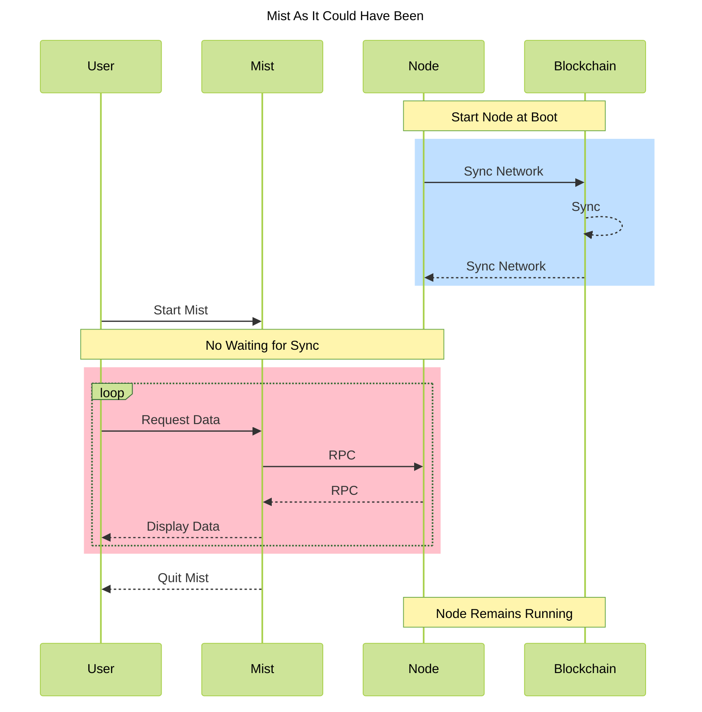

# Mist: As It Could Have Been

```mermaid
%%{init: {'theme': 'forest'}}%%

sequenceDiagram
    title Mist As It Could Have Been

    participant User
    participant Mist
    participant Node
    participant Blockchain

    note over Node,Blockchain: Start Node at Boot
    rect rgb(191, 223, 255)
        Node->>Blockchain: Sync Network
        Blockchain-->>Blockchain: Sync
        Blockchain-->>Node: Sync Network
    end

    User->>Mist: Start Mist

    note over User,Node: No Waiting for Sync
    rect pink
        loop
            User->>Mist: Request Data
            Mist->>Node: RPC
            Node-->>Mist: RPC
            Mist-->>User: Display Data
        end
    end

    Mist-->>User: Quit Mist

    note over Node,Blockchain: Node Remains Running
```
