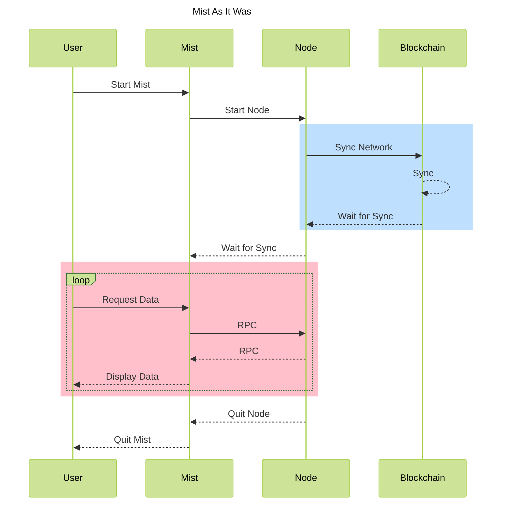

# Mist: As It Was

```mermaid
%%{init: {'theme': 'forest'}}%%

sequenceDiagram
    title Mist As It Was

    participant User
    participant Mist
    participant Node
    participant Blockchain

    User->>Mist: Start Mist
    Mist->>Node: Start Node
    rect rgb(191, 223, 255)
        Node->>Blockchain: Sync Network
        Blockchain-->>Blockchain: Sync
        Blockchain-->>Node: Wait for Sync
    end
    Node-->>Mist: Wait for Sync
    rect pink
        loop
            User->>Mist: Request Data
            Mist->>Node: RPC
            Node-->>Mist: RPC
            Mist-->>User: Display Data
        end
    end
    Node-->>Mist: Quit Node
    Mist-->>User: Quit Mist
```
