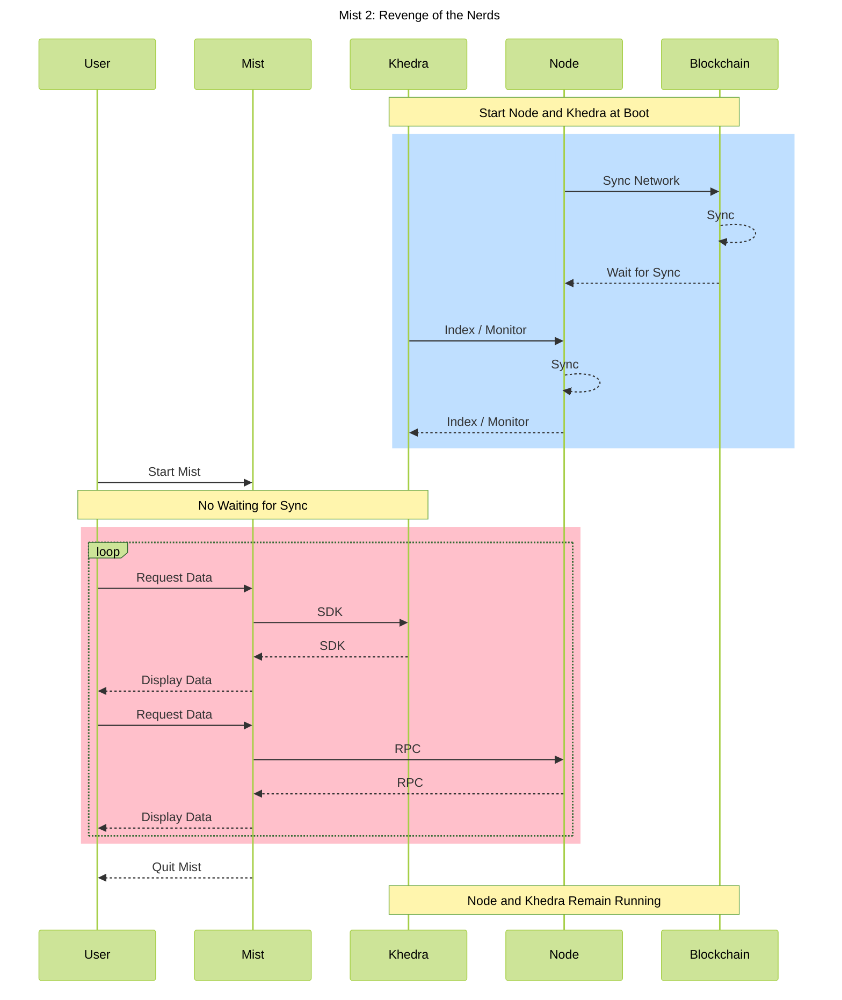

# Mist 2: Revenge of the Nerds

```mermaid
%%{init: {'theme': 'forest'}}%%

sequenceDiagram
    title Mist 2: Revenge of the Nerds

    participant User
    participant Mist
    participant Khedra
    participant Node
    participant Blockchain

    note over Khedra,Blockchain: Start Node and Khedra at Boot
    rect rgb(191, 223, 255)
        rect rgb(191, 223, 255)
            Node->>Blockchain: Sync Network
            Blockchain-->>Blockchain: Sync
            Blockchain-->>Node: Wait for Sync
        end
        rect rgb(191, 223, 255)
            Khedra->>Node: Index / Monitor
            Node-->>Node: Sync
            Node-->>Khedra: Index / Monitor
        end
    end

    User->>Mist: Start Mist

    note over User,Khedra: No Waiting for Sync
    rect pink
        loop
            User->>Mist: Request Data
            Mist->>Khedra: SDK
            Khedra-->>Mist: SDK
            Mist-->>User: Display Data
            User->>Mist: Request Data
            Mist->>Node: RPC
            Node-->>Mist: RPC
            Mist-->>User: Display Data
        end
    end

    Mist-->>User: Quit Mist

    note over Khedra,Blockchain: Node and Khedra Remain Running
```
