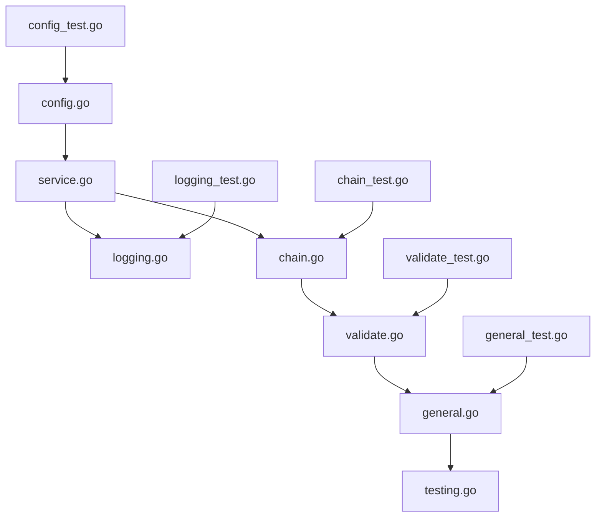

# Architecture

```mermaid
graph TD
    config.go --> service.go
    service.go --> logging.go
    service.go --> chain.go
    chain.go --> validate.go
    validate.go --> general.go
    general.go --> testing.go

    chain_test.go --> chain.go
    validate_test.go --> validate.go
    logging_test.go --> logging.go
    general_test.go --> general.go
    config_test.go --> config.go
```
