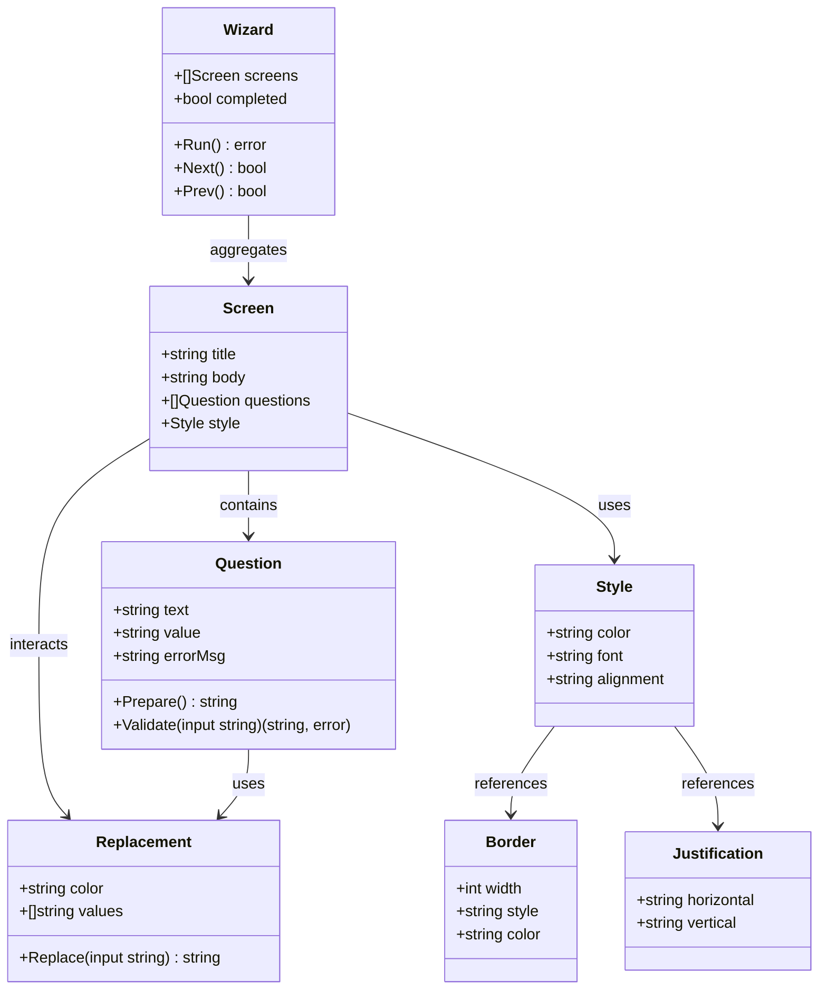

# Class Diagram

```mermaid
classDiagram
    class Style {
        +string color
        +string font
        +string alignment
    }

    class Border {
        +int width
        +string style
        +string color
    }

    class Justification {
        +string horizontal
        +string vertical
    }

    class Screen {
        +string title
        +string body
        +[]Question questions
        +Style style
    }

    class Question {
        +string text
        +string value
        +string errorMsg
        +Prepare() string
        +Validate(input string) (string, error)
    }

    class Replacement {
        +string color
        +[]string values
        +Replace(input string) string
    }

    class Wizard {
        +[]Screen screens
        +bool completed
        +Run() error
        +Next() bool
        +Prev() bool
    }

    Screen --> Question : contains
    Screen --> Style : uses
    Screen --> Replacement : interacts
    Wizard --> Screen : aggregates
    Question --> Replacement : uses
    Style --> Border : references
    Style --> Justification : references
```
