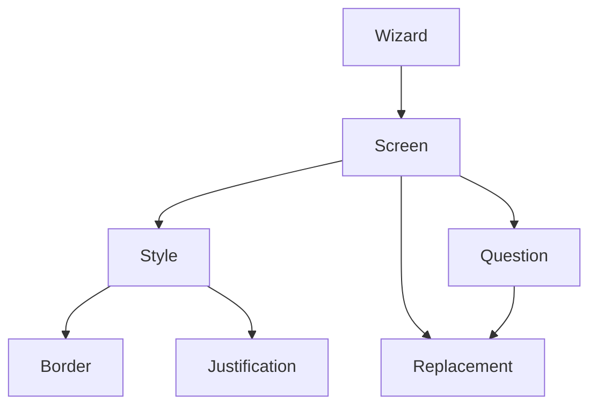

# Flow Chart

```mermaid
flowchart TD
    Style["Style"] --> Border["Border"]
    Style --> Justification["Justification"]

    Screen["Screen"] --> Style
    Screen --> Replacement["Replacement"]
    Screen --> Question["Question"]

    Wizard["Wizard"] --> Screen
    Question --> Replacement
```
