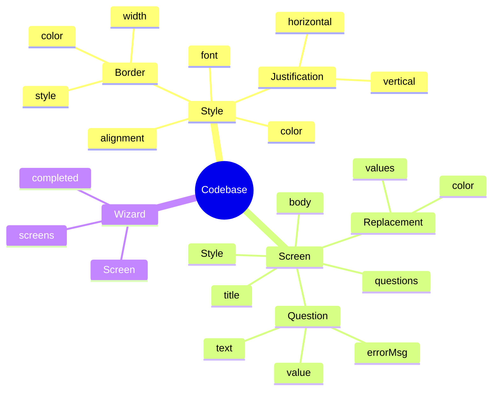

# Mind Map

```mermaid
mindmap
    root((Codebase))
        Style
            color
            font
            alignment
            Border
                width
                style
                color
            Justification
                horizontal
                vertical
        Screen
            title
            body
            questions
            Style
            Replacement
                color
                values
            Question
                text
                value
                errorMsg
        Wizard
            screens
            completed
            Screen
```
